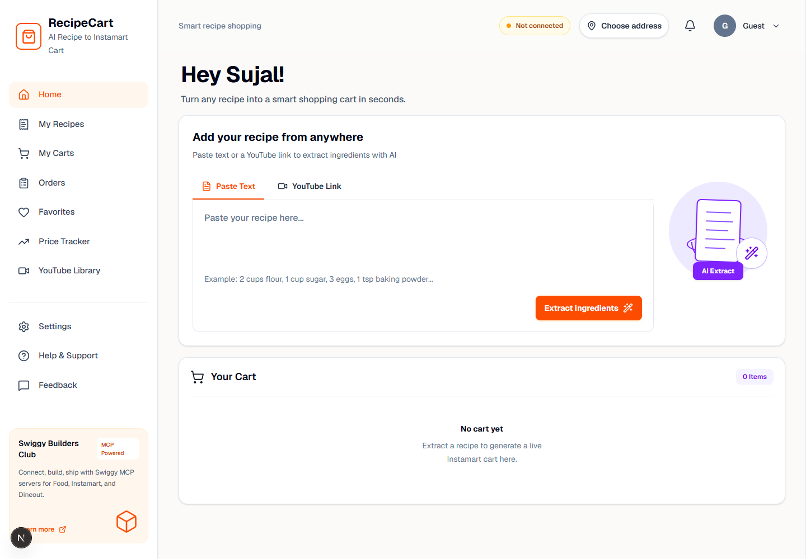
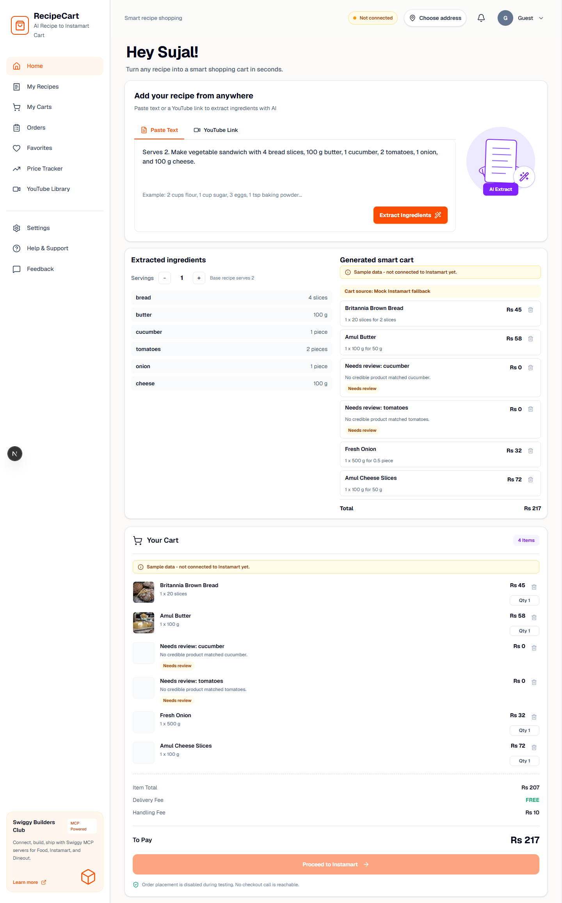
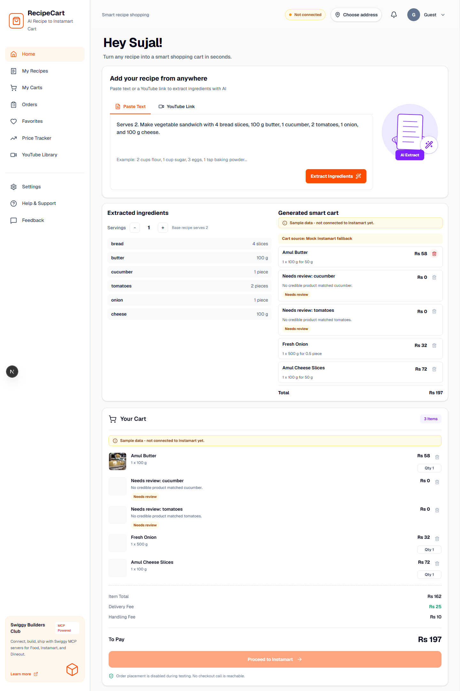
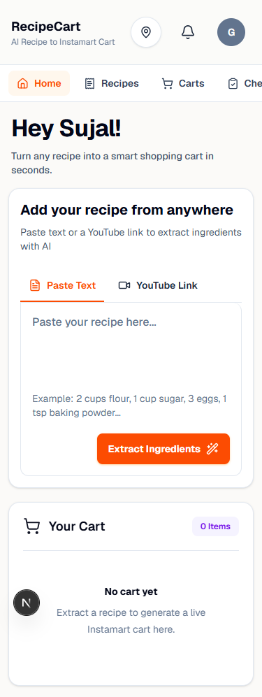

# RecipeCart

AI recipe-to-Instamart cart builder for turning pasted recipes or YouTube cooking videos into an editable grocery cart.

RecipeCart extracts structured ingredients with Gemini, searches Swiggy Instamart through MCP when authenticated, ranks product matches, builds a serving-aware cart, and lets the user remove items before checkout. Checkout/order placement is intentionally disabled during this testing phase.



## Presentation & Demo

- [Presentation deck](docs/media/recipecart-presentation.pdf)
- [Product walkthrough video](docs/media/recipecart-demo.webm)

## Highlights

- Paste a recipe or provide a YouTube cooking link.
- Extract structured ingredients with Gemini JSON output.
- Build a cart from real Swiggy Instamart MCP search results when connected.
- Fall back to clearly labeled mock data when Swiggy auth is unavailable.
- Use semantic filtering and Gemini re-ranking to avoid bad product matches.
- Mark uncertain products as `Needs review` instead of silently adding the wrong item.
- Scale ingredient quantities by serving count.
- Remove cart items and recalculate totals instantly.
- Select a saved Instamart delivery address through a compact topbar popover.
- Keep checkout/order placement unreachable until explicitly implemented.

## Screenshots

| Home | Generated cart |
| --- | --- |
|  |  |

| Remove item | Mobile |
| --- | --- |
|  |  |

## Tech Stack

- Next.js 16 App Router
- React 19
- TypeScript
- Tailwind CSS
- lucide-react icons
- Google Gemini via `@google/genai`
- Swiggy MCP OAuth/PKCE and JSON-RPC tool calls
- `youtube-transcript` for transcript ingestion

## Getting Started

Install dependencies:

```bash
npm install
```

Create local environment variables:

```bash
cp .env.local.example .env.local
```

Fill in at least:

```bash
GEMINI_API_KEY=your_gemini_api_key_here
GEMINI_MODEL=gemini-3.1-flash-lite
SWIGGY_MCP_REDIRECT_URI=http://localhost:3000/api/mcp/callback
```

Run the app:

```bash
npm run dev
```

Open:

```text
http://localhost:3000
```

## Swiggy MCP Auth

The app supports browser-based Swiggy MCP OAuth.

1. Start the app locally.
2. Open the user menu or connection status in the topbar.
3. Connect/reconnect Swiggy.
4. After auth, `/api/mcp/status` reads the HTTP-only session cookie and the UI switches to connected mode.

When not connected, Instamart search falls back to mock data and the UI displays a mock-mode banner.

## Safety Boundary

This project must not place real orders during testing.

Current safety behavior:

- `/api/checkout` returns `501`.
- Checkout button is disabled.
- No order-placement tool call is implemented.
- Read-only actions are allowed: search products, fetch addresses, inspect product data.
- Swiggy-side cart mutation and real checkout are out of scope for the current build.

## Project Structure

```text
app/
  api/
    cart/build/          Cart generation endpoint
    extract/             Paste-text Gemini extraction
    ingest/youtube/      YouTube transcript ingestion
    instamart/addresses/ Read-only address fetch
    mcp/                 Swiggy OAuth/status/logout routes
  page.tsx               Main recipe-to-cart workflow

components/
  address/               Address popover
  cart/                  Persistent cart panel
  layout/                Shell, sidebar, topbar
  shared/                Reusable UI states

contexts/
  cart-context.tsx       Shared cart, recipe, servings, address state

lib/
  cart/                  Scaling, matching, pack selection, totals
  gemini/                Extraction and product re-ranking
  swiggy/                MCP auth/client/service mapping
  config/                UI feature toggles

types/
  cart.ts
  ingredient.ts
  recipe.ts
```

## Architecture

```mermaid
flowchart LR
  User["User"] --> UI["Next.js App UI<br/>Paste Text / YouTube Link"]
  UI --> ExtractAPI["/api/extract<br/>/api/ingest/youtube"]
  ExtractAPI --> GeminiExtract["Gemini<br/>Structured Recipe JSON"]
  GeminiExtract --> RecipeState["Cart Context<br/>Recipe + Servings"]

  RecipeState --> CartAPI["/api/cart/build"]
  CartAPI --> QueryNormalize["Ingredient Query Normalization"]
  QueryNormalize --> SwiggySearch["Swiggy MCP<br/>Instamart search_products"]
  SwiggySearch --> HardFilters["Hard Semantic Filters"]
  HardFilters --> GeminiRank["Gemini Re-rank<br/>Actual Returned Products"]
  GeminiRank --> PackSelect["Pack-size Selection<br/>Quantity Scaling"]
  PackSelect --> CartState["Editable Cart State"]

  UI --> AddressAPI["/api/instamart/addresses"]
  AddressAPI --> SwiggyAddress["Swiggy MCP<br/>get_addresses"]
  SwiggyAddress --> CartState

  CartState --> RightRail["Persistent Cart Panel"]
  CartState --> RemoveItem["Remove Item<br/>Recalculate Totals"]

  CartState -. disabled .-> Checkout["/api/checkout<br/>501 Stub"]
```



The checkout edge is intentionally disabled. The app can search, match, and prepare a cart, but it cannot place a real Instamart order.

## Matching Pipeline

Product matching intentionally happens before pack-size selection:

1. Normalize ingredient query.
2. Search Instamart with an improved grocery query.
3. Apply hard semantic filters.
4. Ask Gemini to re-rank only actual returned products.
5. Reject low-confidence matches.
6. Select pack size from the accepted product list.
7. Show `Needs review` for unresolved ingredients.

This prevents incorrect matches such as garlic becoming curry leaves or bread becoming milk.

## Sample Inputs

Paste-text sample:

```text
Paneer Butter Masala

Serves 3.

Ingredients:
250 grams paneer
2 tablespoons butter
1 tablespoon oil
2 onions, chopped
3 tomatoes, chopped
1 tablespoon ginger garlic paste
10 cashews
1 teaspoon red chilli powder
1 teaspoon garam masala
1 teaspoon coriander powder
1/2 teaspoon turmeric powder
1/2 cup cream
1 teaspoon sugar
1 teaspoon salt
2 tablespoons fresh coriander

Method:
Cook onions, tomatoes, cashews, and ginger garlic paste until soft. Blend into a smooth gravy. Heat butter and oil, add the gravy, spices, salt, and sugar. Simmer for 5 minutes. Add paneer cubes and cream, then cook for another 3 minutes. Garnish with fresh coriander.
```

YouTube sample:

```text
https://youtu.be/2eJ0Jp2t3sU
```

More examples and validation notes are in [docs/sample-cases.md](docs/sample-cases.md).

## Validation

Run:

```bash
npm run lint
npm run build
```

The current repository state has been validated with both commands.

## Environment Notes

- `.env.local` is ignored and should contain real local secrets.
- `.env.local.example` contains placeholders only.
- `.swiggy-mcp-registration.local.json` is ignored because it is local OAuth registration state.
- Dev logs and build artifacts are ignored.

## Current Limitations

- Instagram ingestion is still stubbed.
- File upload ingestion is hidden from the UI for now.
- Some real Instamart search results may still require user review.
- Checkout and order placement are intentionally disabled.
